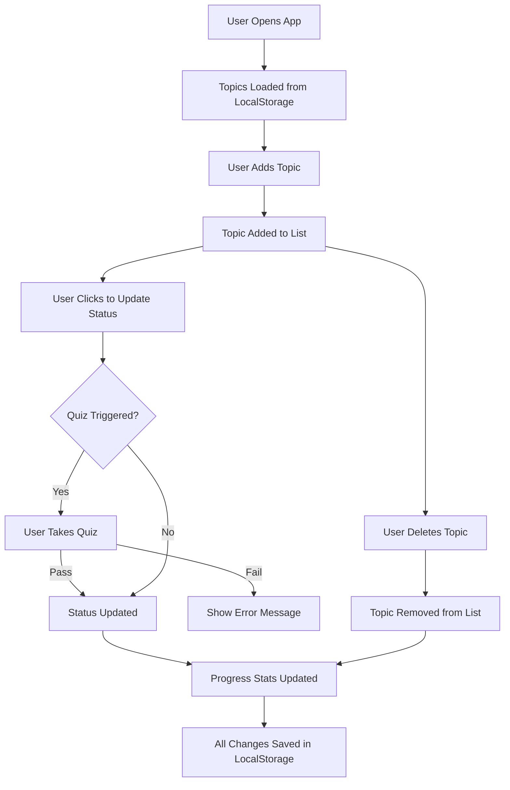

# 📚 Interview Preparation Progress Tracker

A simple, beginner-friendly React.js application to track your interview preparation progress across key topics: DSA, OS, DBMS, CN, and HR. Easily add topics, update your study status, and test your knowledge with built-in quizzes before marking topics as "In Progress" or "Completed". All data persists in LocalStorage.

**🌐 Live Demo:**  
[https://interview-prep-tracker.vercel.app/](https://interview-prep-tracker.vercel.app/)

---

## 🛠️ Tech Stack

- **Frontend:** React.js (Create React App)
- **State & Persistence:** React state + LocalStorage
- **Styling:** Plain CSS (Arial font, moderate style)
- **No backend** (100% client-side)
- **No build tools or advanced configs** (no TypeScript, Vite, Tailwind, or ESLint)

---

## ✨ Features

- **Add New Topics:** Input name, category, and difficulty.
- **Topic List:** View all your topics with status, category, and difficulty.
- **Status Tracking:** Mark as "Not Started", "In Progress", or "Completed".
- **Quiz System:** Must pass a relevant quiz before status update.
- **Delete Topics:** Remove topics with one click.
- **Responsive Design:** Works on desktop and mobile.
- **Progress Stats:** See your completion percentage.
- **Data Persistence:** All actions saved in LocalStorage.
- **Beginner-friendly UI:** Clean, simple, and easy to use.

---

## 🖼️ Screenshots

*(Add screenshots here after running the app!)*

---

## 📊 Workflow Diagram

Below is a simple workflow diagram of how the app works:



---

## 📂 Folder Structure

```
interview-prep-tracker/
├── public/
│   └── index.html
├── src/
│   ├── components/
│   │   ├── Header.js
│   │   ├── ProgressStats.js
│   │   ├── AddTopicForm.js
│   │   ├── TopicCard.js
│   │   ├── QuizModal.js
│   │   └── Footer.js
│   ├── App.js
│   ├── App.css
│   └── index.js
├── package.json
└── README.md
```

---

## 🧪 Test Section (Quiz System)

- Before updating a topic's status to "In Progress" or "Completed", a quiz modal pops up.
- The quiz contains 3 questions relevant to its category (DSA, OS, etc).
- User must score at least 60% to proceed.
- If failed, user cannot update status and is encouraged to try again.

---

## 📈 Progress Tracking

- See count and percentage of topics by status.
- Visual progress bar shows your completion.

---

## 🧑‍💻 How to Run Locally

1. **Clone the repository:**
   ```bash
   git clone https://github.com/sinha-19/Interview-Prep-Tracker.git
   cd Interview-Prep-Tracker
   ```
2. **Install dependencies:**
   ```bash
   npm install
   ```
3. **Run the app:**
   ```bash
   npm start
   ```
4. **Open your browser:**  
   Go to [http://localhost:3000](http://localhost:3000)

---

## 🔮 Future Enhancements

- Search/filter topics by name, category, or status
- Export/import data as JSON
- Dark mode toggle
- More detailed progress analytics
- Customizable quiz questions

---

## 📫 Contact Info

Built by **Saket Kumar Sinha**  
Email: imsaket123@gmail.com  
[GitHub](https://github.com/sinha-19)

---

## © 2025 Saket Kumar Sinha

---

Feel free to contribute, fork, or use this app as your resume project or for personal progress tracking!
